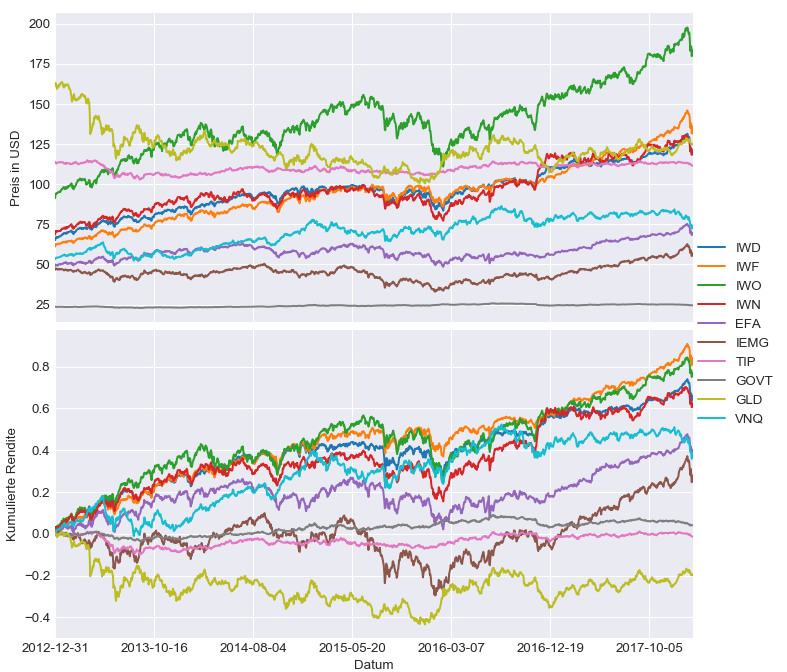
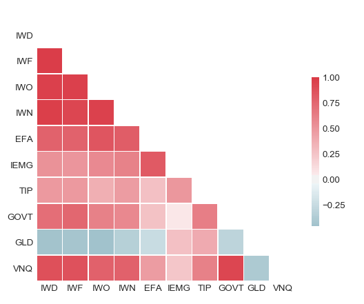
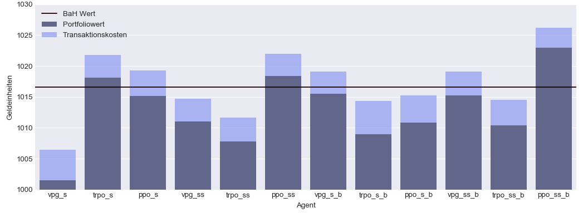
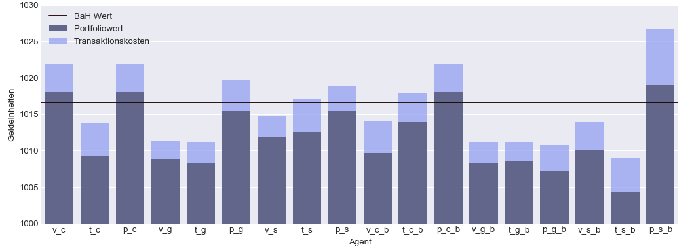
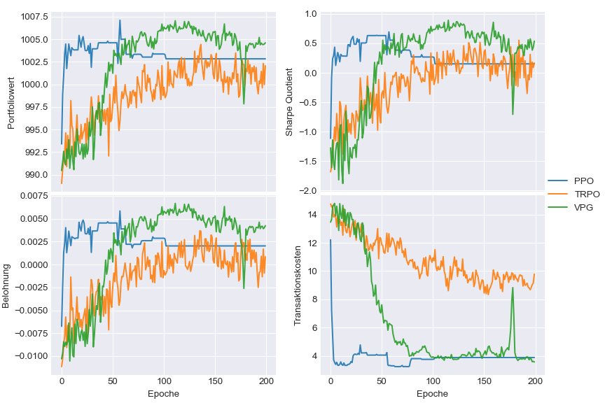
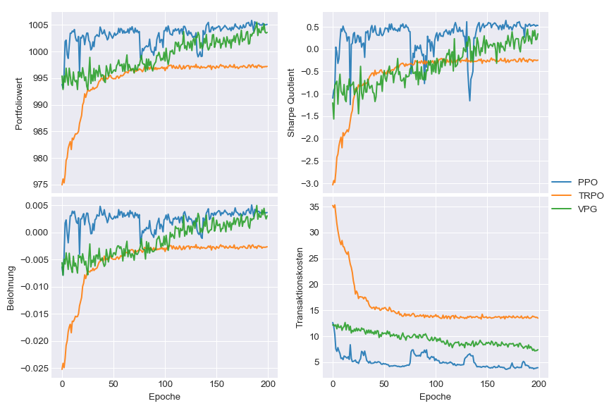

🌍
*[English](README.md) ∙ [German](README_de.md)*

# Reinforcement Learning für die taktische Asset Allocation
> Dieses Projekt beinhaltet das Trainieren und das Testen verschiedener RL Agenten auf einem Portfolio Environment.
> Hierbei gilt für die Interaktion zwischen Environment und Agent: \
> Environment <> Runner <> Agent <> Model

## Wichtige Dateien und Ordner

- Datenbeschaffung: [data.py](env/data/data.py)
- Environment: [environment.py](env/environment.py)
- Hyperparametertuning des Prognosemodells: [predictor.py](/env/predictor.py)
- Training des Prognosemodells: [predictor_network.py](env/predictor_network.py)
- Runner: [runner.py](run/runner.py)
- Grundlegende Konfigurationsparameter: [config.py](config.py)
- Training: [train.py](run/train.py)
- Test: [test.py](run/test.py)
- Agenten Konfigurationen: [agent_config](model/agent_config/)
- NN Konfiguration: [net_config](model/net_config/) 

### Voraussetzungen

Die hier vorgestellte Implementierung erfolgte hauptsächlich in Python,
daher wird zur Replikation der Ergebnisse oder dem Testen der Implementierung 
Python Version >= 3.6 vorausgesetzt.
Folgende Python Packages werden zudem benötigt:

- h5py==2.7.1
- Keras==2.1.3
- matplotlib==2.1.0
- numpy==1.14.1
- pandas==0.20.3
- pandas-datareader==0.5.0
- scikit-learn==0.19.1
- scipy==1.0.0
- seaborn==0.8.1
- tensorflow==1.4.0
- tensorflow-tensorboard==0.4.0rc3
- tensorforce==0.3.5.1

## Ausführen der Trainingsdatei

Zum Training eines Agenten sollte die Datei [train.py](run/train.py) über die Konsole ausgeführt werden. \
Zum Beispiel:
```
python ~/path/to/file/run/train.py -at "clipping" -v 1
```

Änderungen an den Environment und Run Parametern können innerhalb der [Trainingsdatei](run/train.py),
der [Config Datei](config.py) oder über den nachfolgend vorgestellten Flags vorgenommen werden. 

Anpassungen der [Agenten](model/agent_config) und [Modell](model/net_config) Spezifikationen müssen über die jeweiligen 
Konfigurationsdatein im json-Format vorgenommen werden. 

### Flags:

| Flag 1 | Flag 2 | Bedeutung |
|:----:|:----:|-----------|
| -d | --data | Pfad der environment.csv Datei |
| -sp | --split | Training/Test Split |
| -th | --threaded | (bool) Threaded Runner oder Single Runner |
| -ac | --agent-config | Pfad der Agenten Configdatei |
| -nw | --num-worker | Anzahl an Threads falls Threaded ausgewählt wurde |
| -ep | --epochs | Anzahl an Epochen |
| -e | --episodes | Anzahl an Epsioden |
| -hz | --horizon | Investmenthorizont |
| -at | --action-type | Aktionstyp: 'signal', 'signal_softmax', 'direct', 'direct_softmax', 'clipping' |
| -as | --action-space | Aktionsraum: 'unbounded', 'bounded', 'discrete' |
| -na | --num-actions | Anzahl an Aktionen bei diskretem Aktionsraum |
| -mp | --model-path | Pfad für das Speichern des Agenten |
| --eph | --eval-path | Pfad für das Speichern der Evaluierungsdateien |
| -v | --verbose | Gibt an wie viel in der Konsole agezeigt werden soll |
| -l | --load-agent | Falls angegeben wird der Agent von einem früheren Speicherpunkt geladen (Pfad)|
| -ds | --discrete_states | Diskretisiert den State falls True |
| -ss | -standardize-state | (bool) Standardisierter oder normaliserter State |
| -rs | --random-starts | Entweder je Epoche die gleiche Reihenfolge an Episodenstarts oder zufällige |

## Ausführen des Testdatei

Das Ausführen der [Testdatei](run/test.py) entspricht im Wesentlichen dem der Trainingsdatei. 
Es sollte unter [saves](model/saves) ein Checkpoint für das Testen des ausgewählten Agenten vorliegen.
Grundsätzlich werden automatisch die Modelle der trainierten Agenten unter der jeweiligen
Agentenbezeichnung in diesem [Ordner](model/saves) gespeichert. 
```
python ~/path/to/project/run/test.py -l /project/model/saves/AgentName
```

Der Ordner [saved_results](saved_results) enthält für mehrere Parameterkonstellationen
bereits vortrainierte Agenten. Um diese zu testen, müssen dementsprechend die nachfolgenden Flags
passend konfiguriert werden.

### Flags

| Flag | Flag 2 | Bedeutung |
|:----:|:----:|-----------|
| -d | --data | Pfad der environment.csv Datei |
| -ba | --basic-agent | Auswahl eines [BasicAgenten](model/basic_agents.py): 'BuyAndHoldAgent', 'RandomActionAgent'
| -sp | --split | Training/Test Split |
| -ac | --agent-config | Pfad der Agenten Configdatei |
| -e | --episodes | Anzahl an Epsioden |
| -hz | --horizon | Investmenthorizont |
| -at | --action-type | Aktionstyp: 'signal', 'signal_softmax', 'direct', 'direct_softmax', 'clipping' |
| -as | --action-space | Aktionsraum: 'unbounded', 'bounded', 'discrete' |
| -na | --num-actions | Anzahl an Aktionen bei diskretem Aktionsraum |
| --eph | --eval-path | Pfad für das Speichern der Evaluierungsdateien |
| -v | --verbose | Gibt an wie viel in der Konsole angezeigt werden soll |
| -l | --load-agent | Lädt den Agenten von einem früheren Speicherpunkt (Pfad) |
| -ds | --discrete_states | (bool) Diskretisiert den State falls True |
| -ss | -standardize-state | Standardisierter oder normaliserter State |

## TensorBoard

Die Datein [predictor.py](env/predictor.py), sowie [train.py](run/train.py) integrieren
[TensorBoard](https://github.com/tensorflow/tensorboard). 
TensorBoard lässt sich über
```
tensorboard --logdir path/to/project/env/board
tensorboard --logdir path/to/project/run/board
```

starten und über localhost:6006 betrachten. 
Für den TRPO Agenten war leider eine Integration von TensorBoard nicht möglich.

## Anmerkung

Ende Februar 2018 gab es eine größeres [TensorForce](https://github.com/reinforceio/tensorforce)
Update. Hier wird noch eine alte Version verwendet und eine Umstellung war zeitlich nicht 
mehr möglich. Es kann somit bei Verwendung einer neueren Tensorforce Version eventuell zu 
Konflikten kommen.

## Experimentelle Details und Ergebnisse

### Historische Daten 
Für die Experimente wurden Exchange Traded Fund (ETF) Portfolios erstellt. Informationen bezüglich der 
Preisentwicklungen und der Korrelationen der ETFs können den nachfolgenden Abbildungen entnommen werden.

##### Wertentwicklung der einzelnen Anlagen 

##### ETF Preisentwicklungs-Korrelationen


### Testresultate
Die hier vorgestellten Ergebnisse beziehen sich auf unterschiedlichste Agentenkonfigurationen. Die *Buy-and-Hold* 
Strategie (BaH) stellt den Benchmark dar. 
##### Durchschnittlicher Portfolioreturn bei diskreter Aktionswahl

##### Durchschnittlicher Portfolioreturn bei stetiger Aktionswahl


### Trainingsresultate
Im Nachfolgenden sind zur Veranschaulichung die Trainingserfolge der am besten performenden Agenten abgebildet.  

##### Durchschnittlicher Portfolioreturn bei diskreter Aktionswahl

##### Durchschnittlicher Portfolioreturn bei stetiger Aktionswahl

